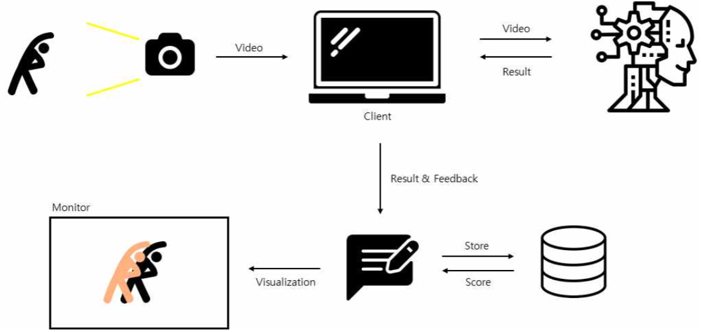
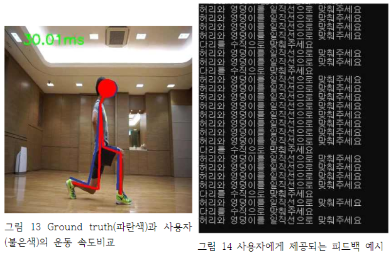
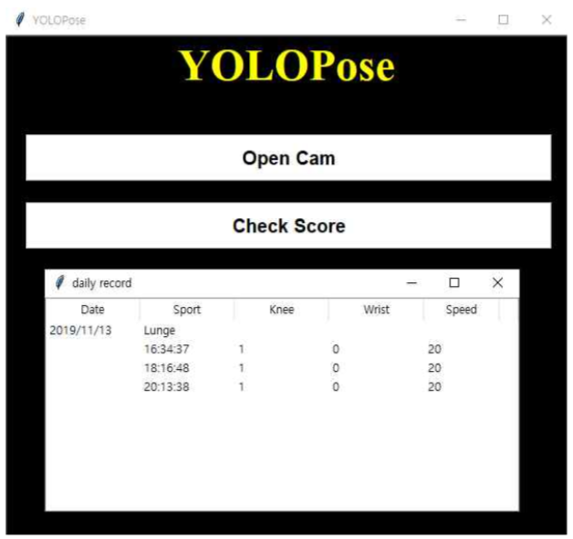

# :muscle: 2019 SW Festival Home PT :muscle:
딥러닝을 활용한 홈짐 트레이닝 서비스

## Dongguk Univ BigData Farm

### 팀원

- 김성진

- 이태민

- 정의정

- 채진영

## SW
### Purpose
어디서든 편하게 운동할 수 있으며 개개인에게 맞춤형 피드백을 제공하는 딥러닝을 활용한 모바일헬스 서비스를 제작한다.

### System Architecture
<p align="center">
  
</p>

### Features
- Pose Estimate using Object Detection
- Feedback SPEED, POSTURE(knee, wrist)
- Providing cumulative score for increasing Engage

## Demo
<p align="center">
  
</p>

### Demo Command
```
python Pose_estimates.py
```

### Pose estimate Result


### Feedback
<p align="left">
  
</p>

### Score record
<p align="left">
  
</p>

### Todo List
- sound feedback

### Done List

- [x] Train COCO Human data
- [x] Make scoring pose algorithm
- [x] Test YOLOv3 with EfficientNet
- [x] Email to Stanford Univ Student to get dataset

## Information
### Version
```
Python : 3.7
Tensorflow : 1.8.0
Opencv : 3.4.2
Pillow : 6.1.0
Pandas : 0.25.0
```

### Weigths Download
The pretrained pose weights file can be downloaded [here](https://drive.google.com/open?id=1mBKWp90YHH-3pzIWzSWKovGqdzKOtNuj). Place this weights file under directory `./data/pose_weights/`


### Reference

- https://github.com/zzh8829/yolov3-tf2

- https://github.com/ZackPashkin/YOLOv3-EfficientNet-EffYolo


